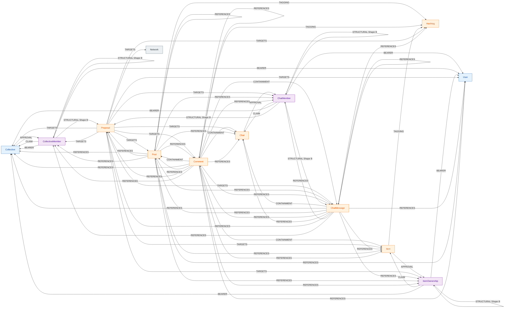

# Structural Edge Map

A visual reference for every structural edge in the CoGra graph,
plus an audit of `(source, target)` pairs where two different
structural edge types could overlap.

The catalog this doc visualizes lives in
[edges.md §2](edges.md#2-structural-edges). The invariant the
audit feeds into is
[edges.md §2 "at most one structural edge per `(source, target)`
pair"](edges.md#2-structural-edges), surfaced in
[invariants.md](invariants.md#topology-and-visibility). This doc
adds no new mechanism — it makes the existing rules navigable.

For the conceptual model (categories, dimensions, append-only),
see [graph-model.md](graph-model.md). For the per-node edge
catalogs that this doc aggregates, see each node's per-node doc
listed in [nodes.md](nodes.md).

---

## 1. Matrix

Rows are **source** node types; columns are **target** node
types. Cells list every structural edge label that can run from
that source to that target. `—` marks pairs with no structural
edge.

`:STRUCTURAL` denotes Shape B vote edges
([edges.md §2 "Voting (Shape B)"](edges.md#voting-shape-b)) —
the only structural-edge family that doesn't take one of the
seven sub-category labels.

Sources and targets with no structural edges in either direction
(`Network`) are still listed so the absence is explicit.

|                      | User       | Coll.      | Post       | Comment    | Chat       | ChatMsg    | Item       | Hashtag    | Proposal   | ChatMbr    | CollMbr    | ItemOwn    | Network    |
|----------------------|------------|------------|------------|------------|------------|------------|------------|------------|------------|------------|------------|------------|------------|
| **User**             | —          | —          | —          | —          | —          | —          | —          | —          | —          | —          | —          | —          | —          |
| **Collective**       | —          | —          | —          | —          | —          | —          | —          | —          | —          | —          | `:APPROVAL`| —          | —          |
| **Post**             | `:REFERENCES` | `:REFERENCES` | `:REFERENCES` | `:REFERENCES` | `:REFERENCES` | `:REFERENCES` | `:REFERENCES` | `:TAGGING` | `:REFERENCES` | `:REFERENCES` | `:REFERENCES` | `:REFERENCES` | `:REFERENCES` |
| **Comment**          | `:REFERENCES` | `:REFERENCES` | `:CONTAINMENT` `:REFERENCES` | `:CONTAINMENT` `:REFERENCES` | `:CONTAINMENT` `:REFERENCES` | `:CONTAINMENT` `:REFERENCES` | `:CONTAINMENT` `:REFERENCES` | `:TAGGING` | `:REFERENCES` | `:REFERENCES` | `:REFERENCES` | `:REFERENCES` | `:REFERENCES` |
| **Chat**             | —          | —          | —          | —          | —          | —          | —          | —          | —          | `:APPROVAL`| —          | —          | —          |
| **ChatMessage**      | `:REFERENCES` | `:REFERENCES` | `:REFERENCES` | `:REFERENCES` | `:CONTAINMENT` `:REFERENCES` | `:REFERENCES` | `:REFERENCES` | `:REFERENCES` | `:REFERENCES` | `:REFERENCES` | `:REFERENCES` | `:REFERENCES` | `:REFERENCES` |
| **Item**             | —          | —          | —          | —          | —          | —          | —          | `:TAGGING` | —          | —          | —          | `:APPROVAL`| —          |
| **Hashtag**          | —          | —          | —          | —          | —          | —          | —          | —          | —          | —          | —          | —          | —          |
| **Proposal**         | `:TARGETS` | `:TARGETS` | `:TARGETS` | `:TARGETS` | `:TARGETS` | `:TARGETS` | `:TARGETS` | `:TARGETS` | —          | `:TARGETS` | `:TARGETS` | `:TARGETS` | `:TARGETS` |
| **ChatMember**       | `:BEARER`  | `:BEARER`  | —          | —          | `:CLAIM`   | `:STRUCTURAL` | —       | —          | `:STRUCTURAL` | `:STRUCTURAL` | —      | —          | —          |
| **CollectiveMember** | `:BEARER`  | `:BEARER`  | —          | —          | —          | —          | —          | —          | `:STRUCTURAL` | —      | `:STRUCTURAL` | —      | —          |
| **ItemOwnership**    | `:BEARER`  | `:BEARER`  | —          | —          | —          | —          | `:CLAIM`   | —          | —          | —          | —          | `:STRUCTURAL` | —       |
| **Network**          | —          | —          | —          | —          | —          | —          | —          | —          | —          | —          | —          | —          | —          |

**Notes on cells with two labels:**

- `Comment → (Post | Comment | Chat | ChatMessage | Item)` —
  `:CONTAINMENT` is the parent-of-comment edge (every Comment
  has exactly one, fixed at creation, per
  [comment.md §4](../instances/comment.md#4-edges));
  `:REFERENCES` is the embed/quote/mention edge. The same node
  pair can in principle host both — see §3.
- `ChatMessage → Chat` — `:CONTAINMENT` is the message's home
  chat ([chats.md §5.2](../instances/chats.md#52-chatmessage));
  `:REFERENCES` would be the message embedding its own home chat
  ([edges.md §2 "Reference"](edges.md#reference)). See §3.

`Proposal → Proposal` is `—` because a Proposal never targets
another Proposal — moderation can't target it and no governance
application proposes changes to a Proposal's own properties (per
[proposal.md §4](../instances/proposal.md#4-edges)).

`Proposal → Network` is `:TARGETS` (the `:Network` singleton is
targeted by parameter-amendment Proposals per
[network.md §11](network.md#11-amending-network-parameters)).

The `ChatMember → ChatMessage` Shape B edge is the
message-disavowal vote
([chats.md §10](../instances/chats.md#10-moderation)). The three
junction-to-Proposal `:STRUCTURAL` rows are Shape B vote edges
to a Proposal whose subject the junction is eligible on. The
junction-to-same-type-junction `:STRUCTURAL` cells are the
membership/ownership approver/removal vote edges.

---

## 2. Diagram

Same information visualized. The diagram groups edges by label;
the matrix above is the canonical reference.

---

## What this doc is not

- **Not the catalog.** Row-level meanings, label assignments,
  and dimension semantics live in
  [edges.md](edges.md). This doc is a visual aggregation.
- **Not the conceptual model.** Categories, directionality,
  append-only — see [graph-model.md](graph-model.md).
- **Not the Memgraph schema.** Concrete edge-property types
  live in
  [graph-data-model.md](../implementation/graph-data-model.md).
